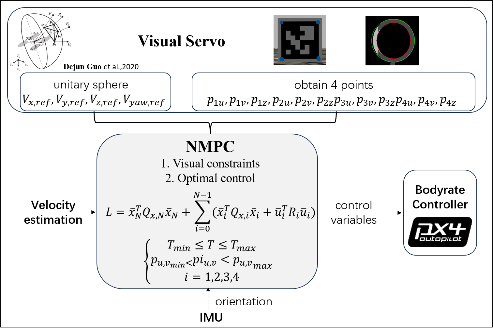

<!--  -->

<!--  -->

<h2 class="h1" style="color: rgb(1,92,171); font-weight: bold; font-size:45px" id="biography">Biography </h2>

Hi! I'm Yuanhang Zhang(张远航). **I'm applying for a MSc/PhD program in Robotics in 2024 fall**. Previously, I received my B.Eng. in Automation from **S**hanghai **J**iao **T**ong **U**niversity(SJTU, Shanghai China) in 2023 and my undergraduate research was advised by [Prof. Hesheng Wang](https://irmv.sjtu.edu.cn/wanghesheng) and [Prof. Danping Zou](http://drone.sjtu.edu.cn/dpzou). I have a profound interest in Robotics which drives me to explore the field of Robotics through conducting researches and participating various types of competitions related to Unmanned-vehicles and Quadrotors.

During my undergraduate career, I was the leader of programming group in [SJTU VEX](https://sjtu-vex.github.io/). My main role was to design planning and controlling algorithms for our custom robots. I also led a team of over 10 undergraduates to implement and fine-tune our self-designed algorithms in order to enable our robots to execute predefined tasks faster and more robustly than any other robots in the VEX-U competition.

<!-- During my leisure time, I also enjoy playing basketball, working out, traveling, and photography. These are all indispensable elements that heal my soul☺. -->
<!-- My research interest falls in the intersection of Human-Computer Interaction, User-Centered Design, and Accessibility. In my research, I study and design tools to support computer-supported creative work for people with disabilities. Through interviews, observations, and content analysis, my work contributes new understanding of how accessibility unfolds at different stages of computer-supported content creation – from learning the tools to developing professional expertise – and the central role communities of disabled creators play in sustaining access in their skilled work. Drawing on these insights, I design and evaluate tools to scaffold accessible learning opportunities for disabled content creators.   -->

<!-- Previously, I completed my Master of Science in Electrical and Computer Engineering (ECE) at Indiana University-Purdue University Indianapolis (IUPUI) and obtained my Bachelor degree (B.Sc.) in Electrical and Electronic Engineering (EEE) at Bangladesh University of Engineering and Technology (BUET).  

I love traveling and photography. Through my camera and lens, I capture the juxtaposition of nature, architecture, and humans as I travel through places and time. -->

<!-- You can find me on [Instagram](http://instagram.com/abirsaha_){:target="_blank"}. -->

<!-- 

  <ul>
    <li> <a href="https://www.linkedin.com/in/abirsaha-" title="LinkedIn" class="no-mark-external" target="_blank">  LinkedIn Yuanhang Zhang's LinkedIn profile</a></li>
    <li> <a href="https://scholar.google.co.uk/citations?hl=en&amp;user=40lh_7kAAAAJ&amp;view_op=list_works&amp;sortby=pubdate" title="Google Scholar" class="no-mark-external" target="_blank">  Google Scholar Yuanhang Zhang's Google Scholar page</a></li>
    <li> <a href="https://twitter.com/abirsaha_" title="Twitter" class="no-mark-external" target="_blank">  Twitter Yuanhang Zhang's Twitter profile</a></li>
    <!-- <li> <a href="https://instagram.com/abiroutdoors" title="Instagram" class="no-mark-external" target="_blank">  Instagram Yuanhang Zhang's Instagram profile</a></li> 
  </ul>

 -->

<h3 class="h2" style="color: rgb(1,92,171); font-size: 35px; font-weight: bold;" id="">Education </h3>
<table class="stretch-table">
  <tbody>
      <tr>
        <td style="width:380px; height:auto;">
          

            Shanghai Jiao Tong University
             
            B.Eng. in Automation
            <!--  
            
            Team Leader -->
          

        </td>
        <td style="float: center; width: auto; height:auto;">
          
          </td>
          <td>
          

            Shanghai, China
             
            2019.09-2023.06
          

        </td>
      </tr>
  </tbody>
</table>
{:.stretch-table}

---
<h2 class="h1" style="color: rgb(1,92,171); font-weight: bold; font-size:45px" id="research">Research </h2>

- <h3 class="h2" style="font-family: sans;color: rgb(0 0 0); font-weight: bold; font-size: 1.47rem; background-color: rgb(255 255 255);">Multiagent Target Sequencing Path Finding with Heterogeneous Task Duration</h3>

  <h4 class="h3" style="color: rgb(128 128 128); font-weight: bold; font-size: 1.2rem; ">Summer Intern in 2023, Advisor: <a href="https://wonderren.github.io/">Dr. Zhongqiang Ren</a></h4>

  <!-- <iframe width="900" height="600" 
  src="https://www.youtube.com/embed/AGlzNG7ZrcM" frameborder="0" 
  allow="accelerometer; autoplay; clipboard-write; encrypted-media; 
  gyroscope; picture-in-picture" allowfullscreen></iframe> -->

    <!-- 1. **Incorporated quadrotor dynamics and visual feature dynamics into NMPC.** -->
    <!-- 2. **Enabled the quadrotor to flight purely based on visual information without localization.** -->
  {:.note title="Undergoing"}

---

- <h3 class="h2" style="font-family: sans;color: rgb(0 0 0); font-weight: bold; font-size: 1.47rem; background-color: rgb(255 255 255);">Perception-constrained Visual Servoing Based NMPC for Quadrotor Flight</h3>

  <h4 class="h3" style="color: rgb(128 128 128); font-weight: bold; font-size: 1.2rem; ">Undergraduation Project(A grade TOP 3%), Advisor: <a href="https://irmv.sjtu.edu.cn/wanghesheng">Prof. Hesheng Wang</a></h4>

  <h5 class="h4" style="font-family: sans; font-size: 1.6rem; color: rgb(1,92,171); line-height: 1.8em; font-weight: bold; margin: 0.2em 0em -0.2em 0em ">Innovation</h5>

  1. Incorporated quadrotor dynamics and visual feature dynamics into NMPC.
  2. Enabled the quadrotor to flight <strong>purely based on visual information without localization.</strong>

  

  <iframe width="100%" height="600" 
  src="https://www.youtube.com/embed/AGlzNG7ZrcM" frameborder="0" 
  allow="accelerometer; autoplay; clipboard-write; encrypted-media; 
  gyroscope; picture-in-picture" allowfullscreen></iframe>

---

<h2 class="h1" style="color: rgb(1,92,171); font-weight: bold; font-size:45px" id="competitions">Competitions </h2>

<table class="stretch-table">
  <tbody>
      <tr>
        <td style="width:auto; height:auto;">
          

            UAV Intelligent Perception Technology Competition
             
            
            National Third Prize(10%)
            <!--  
            
            Team Leader -->
          

        </td>
        <td style="float: center; width: auto; height:auto;">
          
          </td>
          <td>
          

            Shanghai, China
             
            2022.09-2022.11
          

        </td>
      </tr>
  </tbody>
</table>
{:.stretch-table}

- As the team leader, I implemented a SE(3) controller for quadrotor control in PX4-Autopilot, deployed YOLOv5 with TensorRT for object detection and P3P for pose estimation, and used RAPIDDS to generate collision-free trajectories for quadrotor navigation.

  
  

  
  

---

<table class="stretch-table">
  <tbody>
      <tr>
        <td style="width:auto; height:auto;">
          

            National University IOT Design Competition
             
            
            National First Prize & Harmony Innovation Award(1%)
            <!--  
            
            Team Leader -->
          

        </td>
        <td style="float: center; width: auto; height:auto;">
          
          </td>
          <td>
          

            Shanghai, China
             
            2022.06-2022.09
          

        </td>
      </tr>
  </tbody>
</table>
{:.stretch-table}

- As the team leader, I led our team of 4 to design 'HarClass' from scratch, an app for modern intelligent classrooms, utilizing the distributed features of HarmonyOS, leveraged BearPi-HM Micro for environment awareness, and developed a data visualization website using custom communication protocols for cloud connectivity. <a href="https://youtu.be/VAeKPYEZg5o">Here</a> is an introduction to 'HarClass'(in Chinese).

  
  

---

<table class="stretch-table">
  <tbody>
      <tr>
        <td style="width:auto; height:auto;">
          

            National University ICT Competition (Innovation)
             
            
            National Second Prize(5%)
            <!--  
            
            Team Leader -->
          

        </td>
        <td style="float: center; width: auto; height:auto;">
          
          </td>
          <td>
          

            Shanghai, China
             
            2021.09-2022.01
          

        </td>
      </tr>
  </tbody>
</table>
{:.stretch-table}

- As the team leader, I conducted data set collection from edge devices via Socket and utilized the MindSpore framework along with the Ascend chip for the model combination of target detection and controlling. Finally, I deployed the combined model in an automated vehicle and its self-driving process can be found <a href="https://youtu.be/QgceA6COu9s">here.</a>

 

<!-- <iframe width="900" height="600" 
  src="https://www.youtube.com/embed/VAeKPYEZg5o" frameborder="0" 
  allow="accelerometer; autoplay; clipboard-write; encrypted-media; 
  gyroscope; picture-in-picture" allowfullscreen></iframe> -->

<!-- --- -->

<!-- <table class="stretch-table">
  <tbody>
      <tr>
        <td style="width:auto; height:auto;">
          

            National University Unmanned Vehicle Competition(Huawei)
             
            
            National Third Prize(TOP 10%)
          

        </td>
        <td style="float: center; width: auto; height:auto;">
          
          </td>
          <td>
          

            Shenyang, China
             
            2021.06-2021.09
          

        </td>
      </tr>
  </tbody>
</table> -->
<!-- {:.stretch-table} -->

---

<h2 class="h1" style="color: rgb(1,92,171); font-weight: bold; font-size:45px" id="awards">Awards </h2>
   **SJTU Outstanding Graduate(top 5%)** 

   **SJTU Merit Student(top 3%)** 

   **SJTU Academic Progress Scholarship** 

   **SJTU Merit Scholarship** 
    

---

<h2 class="h1" style="color: rgb(1,92,171); font-weight: bold; font-size:45px" id="leadership">Leadership </h2>

<table class="stretch-table">
  <tbody>
      <tr>
        <td style="width:300px; height:auto;">
          

            <a href="https://sjtu-vex.github.io/">SJTU-VEX</a>
             
            
            Program Team Leader
            <!--  
            
            Team Leader -->
          

        </td>
        <td style="float: center; width: auto; height:auto;">
          
          </td>
          <td>
          

            Shanghai, China
             
            2020.03-2023.01
          

        </td>
      </tr>
  </tbody>
</table>
{:.stretch-table}

- Managed a team of 10+ undergraduates to develop algorithms for custom vehicle applications, achieving one of the
highest program level among Chinese universities as well as winning lots of national champions(VEX-U track).

  
  
  

- Led the development of SJTU VEX's AI automation system, including global localization, visual recognition, and
communication modules and presented results to universities and IFI Chinese representatives.

  
  

---

<h2 class="h1" style="color: rgb(1,92,171); font-weight: bold; font-size:45px" id="skills">Skills </h2>

- Programming Languages 
  Python, C++, Matlab, Java

- Tools & Pakages 
  ROS, Gazebo, Airsim, Tensorflow, Pytorch, OpenCV, Numpy.

---

<h2 class="h1" style="color: rgb(1,92,171); font-weight: bold; font-size:45px" id="interests">Interests </h2>
During my leisure time, I also enjoy playing basketball, working out, traveling, and photography. These are all indispensable elements that heal my soul☺.

Here are some cute animals I photographed when travelling in my hometown:

  
  
  

