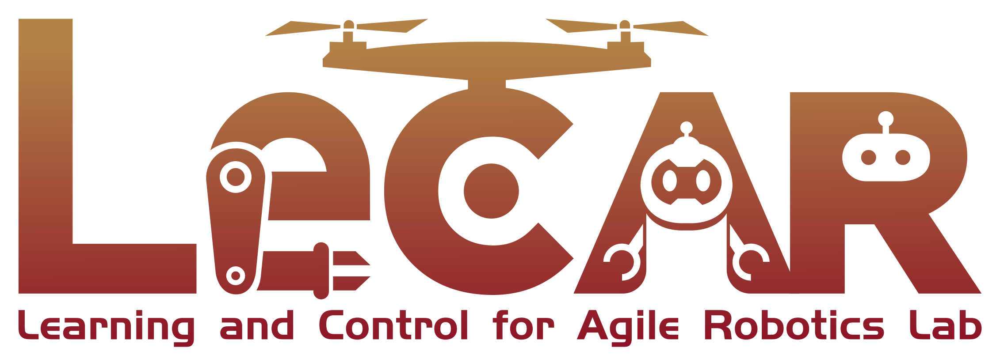
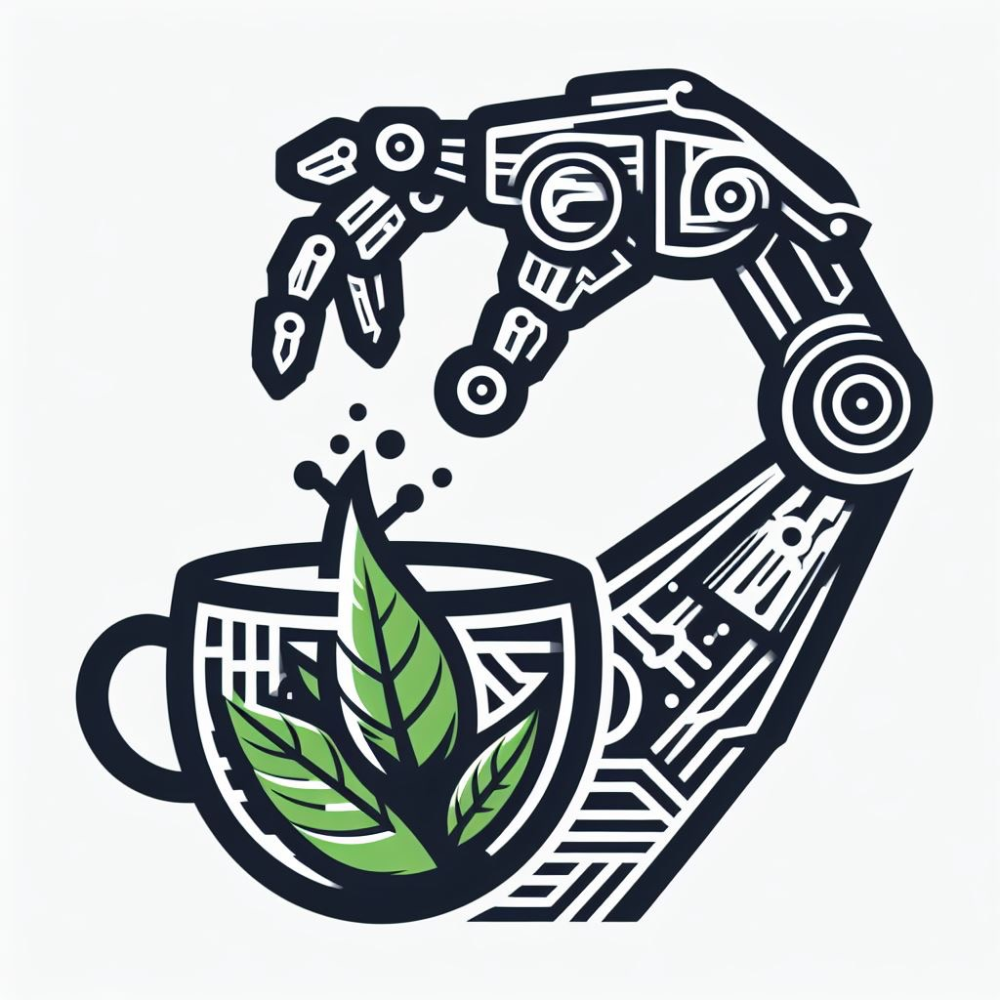
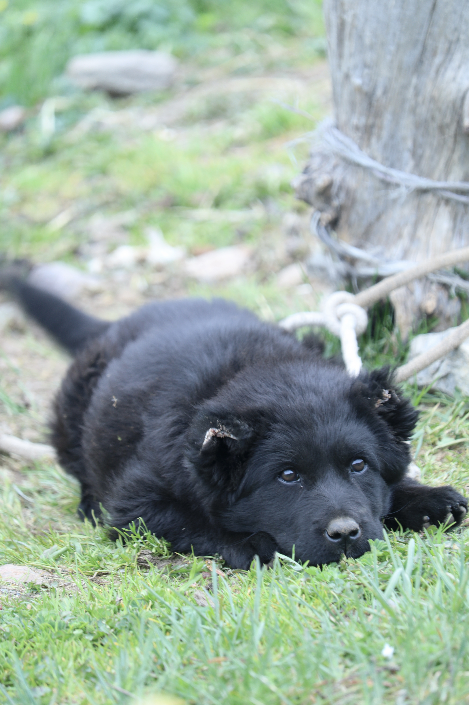

<!--   -->

<!--  -->


<h2 class="h1" style="color: rgb(1,92,171); font-weight: bold; font-size:30px" id="biography">Biography </h2>

I am an Applied Scientist at Amazon FAR (Frontier AI & Robotics). 

I received my Master's degree from the [Robotics Institute at Carnegie Mellon University](https://www.ri.cmu.edu/) advised by [Guanya Shi](https://www.gshi.me/), and Bachelor's degree from [Shanghai Jiao Tong University](https://en.sjtu.edu.cn/) advised by [Hesheng Wang](https://irmv.sjtu.edu.cn/wanghesheng) and [Zhongqiang&nbsp;Ren](https://wonderren.github.io/). I also interned at [Tsinghua University (IIIS)](https://iiis.tsinghua.edu.cn/en/) advised by [Huazhe Xu](http://hxu.rocks/). During my undergraduate career, I led the programming group at [SJTU VEX Robotics Club](https://sjtu-vex.github.io/).

**Current Focus**: Scalable learning systems for robots to perceive, reason, and act reliably in the real world.

**Robots**: I have worked on many types of robots, including <a href="#research-humanoids">humanoids</a>, <a href="#research-aerial-robots">aerial robots</a>, and <a href="#research-mobile-manipulators">mobile manipulators</a>.

<!-- I'm interested in **Robotics**, **Machine Learning** and **Optimal Control**. Currently, I'm working on **Humanoid** and **Aerial Manipulation**. -->
<h3 class="h2" style="color: rgb(1,92,171); font-size: 25px; font-weight: bold;" id="">News </h3>

- **[2026.01.22]** <a href="https://lecar-lab.github.io/falcon-humanoid/">**FALCON**</a> is accepted to <a href="https://sites.google.com/usc.edu/l4dc2026/home/">**L4DC 2026**</a> and selected as an **Oral**!
- **[2025.08.01]** <a href="https://lecar-lab.github.io/SoFTA/">**Hold My Beer**</a> is accepted to <a href="https://www.corl.org/">**CoRL 2025**</a>.
- **[2025.04.11]** <a href="https://agile.human2humanoid.com/">**ASAP**</a> and <a href="https://lecar-lab.github.io/flying_hand/">**Flying Hand**</a> are accepted to <a href="https://2025.ieee-icra.org/">**RSS 2025**</a>.
<!-- - **[2025.03.18]** I will join **Amazon Frontier AI & Robotics Team** as an **Applied Scientist Intern** this summer. -->
- **[2025.01.29]** <a href="https://mobile-dex-catch.github.io/">**Catch It!**</a> is accepted to <a href="https://2025.ieee-icra.org/">**ICRA 2025**</a>.

<h3 class="h2" style="color: rgb(1,92,171); font-size: 25px; font-weight: bold;" id="">Experience </h3>

  

    
    
      Applied Scientist Intern
      May 2025 - Feb. 2026
      <a href="https://www.aboutamazon.com/news/company-news/amazon-covariant-ai-robots" target="_blank">Amazon Frontier AI & Robotics Team</a>
      Advisor: <a href="https://people.eecs.berkeley.edu/~pabbeel/" target="_blank">Prof. Pieter Abbeel</a> and <a href="http://rockyduan.com/" target="_blank">Dr. Rocky Duan</a>
    
  

  

    
    
      Research Assistant
      Oct. 2024 - May 2026
      <a href="https://lecar-lab.github.io/" target="_blank">LeCAR Lab, CMU RI</a>
      Advisor: <a href="https://www.gshi.me/" target="_blank">Prof. Guanya Shi</a>
    
  

  

    
    
      Research Assistant
      Jan. 2024 - Jul. 2024
      <a href="http://hxu.rocks/index.html" target="_blank">Tsinghua Embodied AI Lab (TEA Lab)</a>
      Advisor: <a href="http://hxu.rocks/" target="_blank">Prof. Huazhe Xu</a>
    
  

<h3 class="h2" style="color: rgb(1,92,171); font-size: 25px; font-weight: bold;" id="">Education </h3>

  

    
    
      Carnegie Mellon University
      Aug. 2024 - May 2026
      M.S. in Robotic Systems Development
    
  

  

    
    
      Shanghai Jiao Tong University
      Sep. 2019 - Jun. 2023
      B.Eng. in Automation
    
  

<!-- You can find me on [Instagram](http://instagram.com/abirsaha_){:target="_blank"}. -->

<!-- 

  <ul>
    <li> <a href="https://www.linkedin.com/in/abirsaha-" title="LinkedIn" class="no-mark-external" target="_blank">  LinkedIn Yuanhang Zhang's LinkedIn profile</a></li>
    <li> <a href="https://scholar.google.co.uk/citations?hl=en&amp;user=40lh_7kAAAAJ&amp;view_op=list_works&amp;sortby=pubdate" title="Google Scholar" class="no-mark-external" target="_blank">  Google Scholar Yuanhang Zhang's Google Scholar page</a></li>
    <li> <a href="https://twitter.com/abirsaha_" title="Twitter" class="no-mark-external" target="_blank">  Twitter Yuanhang Zhang's Twitter profile</a></li>
    <!-- <li> <a href="https://instagram.com/abiroutdoors" title="Instagram" class="no-mark-external" target="_blank">  Instagram Yuanhang Zhang's Instagram profile</a></li> 
  </ul>

 -->

---
{::nomarkdown}

{:/nomarkdown}

---



---



---



---



---

<!-- ---

<h2 class="h1" style="color: rgb(1,92,171); font-weight: bold; font-size:30px" id="skills">Skills </h2>

- Programming Languages 
  Python, C++, Matlab, Java

- Tools & Pakages 
  ROS, Mujoco, IsaacGym, Pytorch, Tensorflow, OpenCV, Gazebo, Airsim.

--- -->

<!-- <h2 class="h1" style="color: rgb(1,92,171); font-weight: bold; font-size:30px" id="interests">Interests </h2>
During my leisure time, I also enjoy playing basketball, working out, traveling, and photography. These are all indispensable elements that heal my soul☺.

Here are some cute animals I photographed when travelling in my hometown:

  
  
  

 -->

  

<!--posts-->

