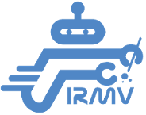
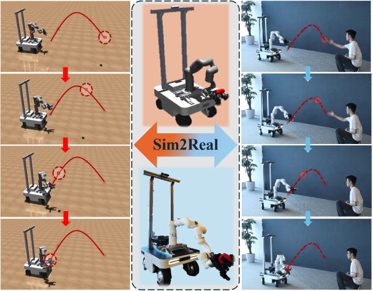

<!--  -->

<!--  -->

<h2 class="h1" style="color: rgb(1,92,171); font-weight: bold; font-size:30px" id="biography">Biography </h2>

**I'm an MS student at [CMU RI](https://www.ri.cmu.edu/), working at [LeCAR Lab](https://lecar-lab.github.io/) advised by [Prof. Guanya Shi](https://www.gshi.me/).** 

Previously, I received my B.Eng. from [Shanghai Jiao Tong University (SJTU)](https://en.sjtu.edu.cn/), where I was advised by [Prof. Hesheng Wang](https://irmv.sjtu.edu.cn/wanghesheng) and [Prof. Danping Zou](http://drone.sjtu.edu.cn/dpzou). After that, I worked with [Prof. Richard Ren](https://wonderren.github.io/) remotely during a summer research. Subsequently, I worked with [Prof. Huazhe Xu](http://hxu.rocks/) as a research assistant at [Tsinghua University (IIS)](https://iiis.tsinghua.edu.cn/en/).

During my undergraduate career, I led the programming group at [SJTU VEX Robotics Club](https://sjtu-vex.github.io/). Additionally, I have participated other types of <a href="#competitions">competitions</a> related to Unmanned Vehicles (UV) and Unmanned Aerial Vehicle (UAV).

I'm interested in **Robotics**, **Machine Learning** and **Optimal Control**. Currently, I'm working on **Humanoid** and **Aerial Manipulation**.

<h3 class="h2" style="color: rgb(1,92,171); font-size: 25px; font-weight: bold;" id="">Education </h3>

  

      

          
      

      

          
              <b style="font-size: 18px;">Carnegie Mellon University</b>
              Aug. 2024 - Present
           
          Master Student 
          Major: Robotic Systems Development 
      

  

  <!--   -->
  

      

          
      

      

          
              <b style="font-size: 18px;">Shanghai Jiao Tong University</b>
              Sep. 2019 - Jun. 2023
           
          Undergraduate Student 
          Major: Automation 
      

  

<h3 class="h2" style="color: rgb(1,92,171); font-size: 25px; font-weight: bold;" id="">Experience </h3>

    

        

            
        

        

            
                <b style="font-size: 18px;">Full-time Research Assistant</b>
                Jan. 2024 - Jul. 2024
             
            <a href="http://hxu.rocks/index.html" target="_blank">Tsinghua Embodied AI Lab (TEA Lab)</a> 
            Advisor: <a href="http://hxu.rocks/" target="_blank">Prof. Huazhe Xu</a> 
            Topic: Mobile Manipulation
        

    

     
    

        

            
        

        

            
                <b style="font-size: 18px;">Research Intern (Remote)</b>
                Summer 2023
             
            <a href="https://rap-lab.github.io/" target="_blank">Robotics Autonomy and Planning Lab at SJTU</a> 
            Advisor: <a href="https://wonderren.github.io/" target="_blank">Prof. Zhongqiang Ren</a> 
            Topic: Multi-Agent Path Finding
        

    

     
    

        

            
        

        

            
                <b style="font-size: 18px;">Undergraduate Research Assistant</b>
                Jan. 2023 - Jun. 2023
             
            <a href="https://irmv.sjtu.edu.cn/" target="_blank">Intelligent Robotics and Machine Vision Lab at SJTU</a> 
            Advisor: <a href="https://irmv.sjtu.edu.cn/wanghesheng" target="_blank">Prof. Hesheng Wang</a> 
            Topic: Image-Based Visual Servo for Quadrotor
        

    

    <!--  
    

        

            
        

        

            
                <b style="font-size: 18px;">Undergraduate Research Assistant</b>
                Sep. 2022 - Feb. 2023
             
            <a href="https://isn.sjtu.edu.cn/web/index" target="_blank">Institute for Sensing and Navigation at SJTU</a> 
            Advisor: <a href="https://drone.sjtu.edu.cn/dpzou/" target="_blank">Prof. Danping Zou</a> 
            Topic: Autonomous Drone Racing
        

    
 -->
     

<!-- You can find me on [Instagram](http://instagram.com/abirsaha_){:target="_blank"}. -->

<!-- 

  <ul>
    <li> <a href="https://www.linkedin.com/in/abirsaha-" title="LinkedIn" class="no-mark-external" target="_blank">  LinkedIn Yuanhang Zhang's LinkedIn profile</a></li>
    <li> <a href="https://scholar.google.co.uk/citations?hl=en&amp;user=40lh_7kAAAAJ&amp;view_op=list_works&amp;sortby=pubdate" title="Google Scholar" class="no-mark-external" target="_blank">  Google Scholar Yuanhang Zhang's Google Scholar page</a></li>
    <li> <a href="https://twitter.com/abirsaha_" title="Twitter" class="no-mark-external" target="_blank">  Twitter Yuanhang Zhang's Twitter profile</a></li>
    <!-- <li> <a href="https://instagram.com/abiroutdoors" title="Instagram" class="no-mark-external" target="_blank">  Instagram Yuanhang Zhang's Instagram profile</a></li> 
  </ul>

 -->

---
<h2 class="h1" style="color: rgb(1,92,171); font-weight: bold; font-size:30px" id="research">Research</h2>

- <h3 class="h2" style="font-family: sans;color: rgb(0 0 0); font-size: 1.2rem; background-color: rgb(255 255 255);">
  Catch It! Learning to Catch in Flight with Mobile Dexterous Hands
   
  Yuanhang Zhang&dagger;,
  <a href="https://tinhal.github.io/">Tianhai Liang&dagger;</a>, <a href="https://chenzheny.github.io/">Zhenyang Chen</a>, 
  <a href="https://yanjieze.com/">Yanjie Ze</a>, <a href="http://hxu.rocks/index.html">Huazhe Xu</a>
  </h3>
  - <h4 class="h3" style="color: rgb(128 128 128); font-weight: bold; font-size: 1.0rem; ">In Submission for ICRA 2025</h4>
  - <h4 class="h3" style="color: rgb(128 128 128); font-weight: bold; font-size: 1.0rem; ">Links: <a href="https://arxiv.org/abs/2409.10319">[arXiv]</a><a href="https://mobile-dex-catch.github.io/">[Website]</a><a href="https://github.com/hang0610/Catch_It">[Code]</a><a href="https://x.com/Yuanhang__Zhang/status/1839887809739358439">[Twitter]</a></h4>
  <!-- - <h4 class="h3" style="color: rgb(128 128 128); font-weight: bold; font-size: 1.0rem; ">Links: <a href="https://arxiv.org/abs/2311.15330">[arXiv]</a><a href="https://github.com/rap-lab-org/public_pymcpf-d.git">[Code]</a><a href="https://www.youtube.com/embed/sSX0HdzjmY4">[Video]</a></h4>  -->
  <!-- - <h4 class="h3" style="color: rgb(128 128 128); font-weight: bold; font-size: 1.0rem; ">International Symposium on Combinatorial Search (<strong>SoCS</strong>, <a href="https://hang0610.github.io/publications/SoCS24_paper_54.pdf">The Extended Abstract</a>)</h4> -->

  <h5 class="h4" style="font-family: sans; font-size: 1.1rem; color: rgb(1,92,171); line-height: 1.8em; font-weight: bold; margin: 0.2em 0em -0.2em 0em; ">Summary</h5>
  

      We build a mobile manipulator with a dexterous hand, and leverage reinforcement learning to train a whole-body control policy for the robot to catch diverse objects randomly thrown by humans. 
  

  

  <!-- <iframe width="103.6%" height="600" 
  src="https://www.youtube.com/embed/sSX0HdzjmY4" frameborder="0" 
  allow="accelerometer; autoplay; clipboard-write; encrypted-media; 
  gyroscope; picture-in-picture" allowfullscreen></iframe>
  {:.note title="Undergoing"} -->

---

- <h3 class="h2" style="font-family: sans;color: rgb(0 0 0); font-size: 1.2rem; background-color: rgb(255 255 255);">
  Multi-Agent Combinatorial Path Finding with Heterogeneous Task Duration
   
  Yuanhang Zhang,
  Xuemian Wu, 
  <a href="https://irmv.sjtu.edu.cn/wanghesheng">Hesheng Wang</a>, <a href="https://wonderren.github.io/">Zhongqiang Ren</a>
  </h3>
  - <h4 class="h3" style="color: rgb(128 128 128); font-weight: bold; font-size: 1.0rem; ">In Submission for ICRA 2025</h4> 
  - <h4 class="h3" style="color: rgb(128 128 128); font-weight: bold; font-size: 1.0rem; ">Links: <a href="https://arxiv.org/abs/2311.15330">[arXiv]</a><a href="https://github.com/rap-lab-org/public_pymcpf-d.git">[Code]</a><a href="https://www.youtube.com/embed/sSX0HdzjmY4">[Video]</a></h4> 
  <!-- - <h4 class="h3" style="color: rgb(128 128 128); font-weight: bold; font-size: 1.0rem; ">International Symposium on Combinatorial Search (<strong>SoCS</strong>, <a href="https://hang0610.github.io/publications/SoCS24_paper_54.pdf">The Extended Abstract</a>)</h4> -->

  <h5 class="h4" style="font-family: sans; font-size: 1.1rem; color: rgb(1,92,171); line-height: 1.8em; font-weight: bold; margin: 0.2em 0em -0.2em 0em; ">Summary</h5>
  

      Proposed two conflict-based search methods—CBSS-TPG (conflict-free) and CBSS-D (conflict-free and minimal cost) to solve the multi-agent combinatorial path finding problem with target duration. 
  

  <!--  -->
  

  <!-- <iframe width="103.6%" height="600" 
  src="https://www.youtube.com/embed/sSX0HdzjmY4" frameborder="0" 
  allow="accelerometer; autoplay; clipboard-write; encrypted-media; 
  gyroscope; picture-in-picture" allowfullscreen></iframe>
  {:.note title="Undergoing"} -->

---

- <h3 class="h2" style="font-family: sans;color: rgb(0 0 0); font-size: 1.2rem; background-color: rgb(255 255 255);">
  ViTaS: Visual Tactile Soft Fusion Contrastive Learning for Reinforcement Learning
   
  Yufeng Tian&dagger;, 
  Shuiqi Cheng&dagger;, 
  <a href="https://www.stillwtm.site/">Tianming Wei</a>, 
  Tianxing Zhou, 
  Yuanhang Zhang,
  <a href="https://storeblank.github.io/">Zixian Liu</a>, 
   
  <a href="https://gemcollector.github.io/">Zhecheng Yuan</a>, 
  <a href="http://hxu.rocks/index.html">Huazhe Xu</a> 
  </h3>
  - <h4 class="h3" style="color: rgb(128 128 128); font-weight: bold; font-size: 1.0rem; ">Under Review, 2024</h4> 
  <!-- - <h4 class="h3" style="color: rgb(128 128 128); font-weight: bold; font-size: 1.0rem; ">Links: <a href="https://arxiv.org/abs/2311.15330">[arXiv]</a><a href="https://github.com/rap-lab-org/public_pymcpf-d.git">[Code]</a><a href="https://www.youtube.com/embed/sSX0HdzjmY4">[Video]</a></h4>  -->
  <!-- - <h4 class="h3" style="color: rgb(128 128 128); font-weight: bold; font-size: 1.0rem; ">International Symposium on Combinatorial Search (<strong>SoCS</strong>, <a href="https://hang0610.github.io/publications/SoCS24_paper_54.pdf">The Extended Abstract</a>)</h4> -->

  <h5 class="h4" style="font-family: sans; font-size: 1.1rem; color: rgb(1,92,171); line-height: 1.8em; font-weight: bold; margin: 0.2em 0em -0.2em 0em; ">Summary</h5>
  

      Introduced ViTaS, a framework using using Soft Fusion Contrastive Learning and a CVAE module to fuse visual and tactile information, achieving state-of-the-art performance with high sample efficiency and low parameter count in robotic manipulation. 
  

  <!--  -->
  

  <!-- <iframe width="103.6%" height="600" 
  src="https://www.youtube.com/embed/sSX0HdzjmY4" frameborder="0" 
  allow="accelerometer; autoplay; clipboard-write; encrypted-media; 
  gyroscope; picture-in-picture" allowfullscreen></iframe>
  {:.note title="Undergoing"} -->

---
- <h3 class="h2" style="font-family: sans;color: rgb(0 0 0); font-weight: bold; font-size: 1.2rem; background-color: rgb(255 255 255);">Perception-constrained Visual Servoing Based NMPC for Quadrotor Flight</h3>
  <!-- - <h4 class="h3" style="color: rgb(128 128 128); font-weight: bold; font-size: 1.2rem; ">Date: 2023.2—2023.6</h4> -->
  - <h4 class="h3" style="color: rgb(128 128 128); font-weight: bold; font-size: 1.0rem; ">Undergraduate Thesis (A grade TOP 3%), Advisor: <a href="https://irmv.sjtu.edu.cn/wanghesheng">Prof. Hesheng Wang</a></h4>
  - <h4 class="h3" style="color: rgb(128 128 128); font-weight: bold; font-size: 1.0rem; ">Links: <a href="https://gitee.com/Hang_SJTU/ibvs_nmpc_px4_ws.git">[Code]</a><a href="https://www.youtube.com/embed/3kP_b1RegkI">[Video]</a></h4>

  <h5 class="h4" style="font-family: sans; font-size: 1.1rem; color: rgb(1,92,171); line-height: 1.8em; font-weight: bold; margin: 0.2em 0em -0.2em 0em; ">Summary</h5>
  

      Incorporated quadrotor dynamics and visual feature dynamics into NMPC to enable the quadrotor to flight 
      purely based on visual information without localization.
  

  <!-- 1. Incorporated quadrotor dynamics and visual feature dynamics into NMPC.
  1. Enabled the quadrotor to flight <strong>purely based on visual information without localization.</strong> -->

  
  <!--  -->

  <!-- <iframe width="100%" height="600" 
  src="https://www.youtube.com/embed/AGlzNG7ZrcM" frameborder="0" 
  allow="accelerometer; autoplay; clipboard-write; encrypted-media; 
  gyroscope; picture-in-picture" allowfullscreen></iframe> -->
 

---
<h2 class="h1" style="color: rgb(1,92,171); font-weight: bold; font-size:30px" id="competitions">Competitions </h2>

<table class="stretch-table" style="margin: -0.2em 0em 0.5em -0.5em;  width: 50%">
  <tbody>
      <tr>
        <td style=" height:auto;">
          

            UAV Intelligent Perception Technology Competition
             
            
            National Third Prize (10%)
            <!--  
            
            Team Leader -->
          

        </td>
        <td style="float: center; height:auto;">
          
          </td>
          <td>
          

            Shanghai, China
             
            2022.09-2022.11
          

        </td>
      </tr>
  </tbody>
</table>
{:.stretch-table}

- As the team leader, I implemented a SE(3) controller for quadrotor control in PX4-Autopilot, deployed YOLOv5 with TensorRT for object detection and P3P for pose estimation, and used RAPIDDS to generate collision-free trajectories for quadrotor navigation.

  

    
    
  

  

    
    
  

---

<table class="stretch-table" style="margin: 0.5em 0em 0.5em -0.5em; ">
  <tbody>
      <tr>
        <td style="width:auto; height:auto;">
          

            National University IOT Design Competition
             
            
            National First Prize & Harmony Innovation Award (1%)
            <!--  
            
            Team Leader -->
          

        </td>
        <td style="float: center; width: auto; height:auto;">
          
          </td>
          <td>
          

            Shanghai, China
             
            2022.06-2022.09
          

        </td>
      </tr>
  </tbody>
</table>
{:.stretch-table}

- As the team leader, I led our team of 4 to design 'HarClass' from scratch, an app for modern intelligent classrooms, utilizing the distributed features of HarmonyOS, leveraged BearPi-HM Micro for environment awareness, and developed a data visualization website using custom communication protocols for cloud connectivity. <a href="https://youtu.be/VAeKPYEZg5o">[Video]</a>

  

    
    
  

---

<table class="stretch-table" style="margin: 0.5em 0em 0.5em -0.5em; width: 90%">
  <tbody>
      <tr>
        <td style="width:auto; height:auto;">
          

            National University ICT Competition (Innovation)
             
            
            National Second Prize (5%)
            <!--  
            
            Team Leader -->
          

        </td>
        <td style="float: center; width: auto; height:auto;">
          
          </td>
          <td>
          

            Shanghai, China
             
            2021.09-2022.01
          

        </td>
      </tr>
  </tbody>
</table>
{:.stretch-table}

- As the team leader, I conducted data set collection from edge devices via Socket and utilized the MindSpore framework along with the Ascend chip for the model combination of target detection and controlling. Finally, I deployed the combined model in an automated vehicle. <a href="https://youtu.be/QgceA6COu9s">[Video]</a>

   

<!--  -->
<!-- <iframe width="900" height="600" 
  src="https://www.youtube.com/embed/VAeKPYEZg5o" frameborder="0" 
  allow="accelerometer; autoplay; clipboard-write; encrypted-media; 
  gyroscope; picture-in-picture" allowfullscreen></iframe> -->

<!-- --- -->

<!-- <table class="stretch-table">
  <tbody>
      <tr>
        <td style="width:auto; height:auto;">
          

            National University Unmanned Vehicle Competition(Huawei)
             
            
            National Third Prize(TOP 10%)
          

        </td>
        <td style="float: center; width: auto; height:auto;">
          
          </td>
          <td>
          

            Shenyang, China
             
            2021.06-2021.09
          

        </td>
      </tr>
  </tbody>
</table> -->
<!-- {:.stretch-table} -->
 

---

<h2 class="h1" style="color: rgb(1,92,171); font-weight: bold; font-size:30px" id="awards">Awards </h2>
   **SJTU Outstanding Graduate (top 5%)** 

   **SJTU Merit Student (top 3%)** 

   **SJTU Academic Progress Scholarship** 

   **SJTU Merit Scholarship** 
    
 

---

<h2 class="h1" style="color: rgb(1,92,171); font-weight: bold; font-size:30px" id="leadership">Leadership </h2>

<table class="stretch-table" style="margin: -0.2em 0em 0.5em -0.5em; ">
  <tbody>
      <tr>
        <td style="width:300px; height:auto;">
          

            <a href="https://sjtu-vex.github.io/">SJTU-VEX</a>
             
            
            Programming Team Leader
            <!--  
            
            Team Leader -->
          

        </td>
        <td style="float: center; width: auto; height:auto;">
          
          </td>
          <td>
          

            Shanghai, China
             
            2020.03-2023.01
          

        </td>
      </tr>
  </tbody>
</table>
{:.stretch-table}

- Managed a team of 20+ undergraduates to develop algorithms for custom vehicle applications, achieving one of the highest program level among Chinese universities as well as winning lots of national/international champions.

  

    
    
    
  

- Led the development of SJTU VEX's AI automation system, including global localization, visual recognition, and communication modules and presented results to universities and IFI Chinese representatives.

  

    
    
  

 

---

<h2 class="h1" style="color: rgb(1,92,171); font-weight: bold; font-size:30px" id="service">Service </h2>

- Reviewer: 
  ICRA 2025

---

<!-- ---

<h2 class="h1" style="color: rgb(1,92,171); font-weight: bold; font-size:30px" id="skills">Skills </h2>

- Programming Languages 
  Python, C++, Matlab, Java

- Tools & Pakages 
  ROS, Mujoco, IsaacGym, Pytorch, Tensorflow, OpenCV, Gazebo, Airsim.

--- -->

<!-- <h2 class="h1" style="color: rgb(1,92,171); font-weight: bold; font-size:30px" id="interests">Interests </h2>
During my leisure time, I also enjoy playing basketball, working out, traveling, and photography. These are all indispensable elements that heal my soul☺.

Here are some cute animals I photographed when travelling in my hometown:

  
  
  

 -->

